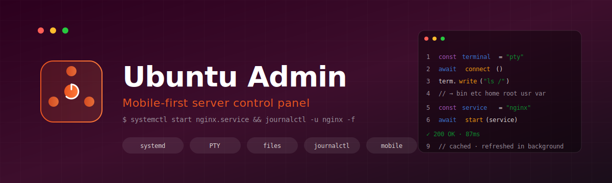
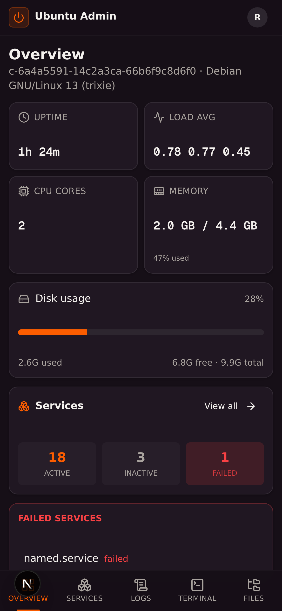
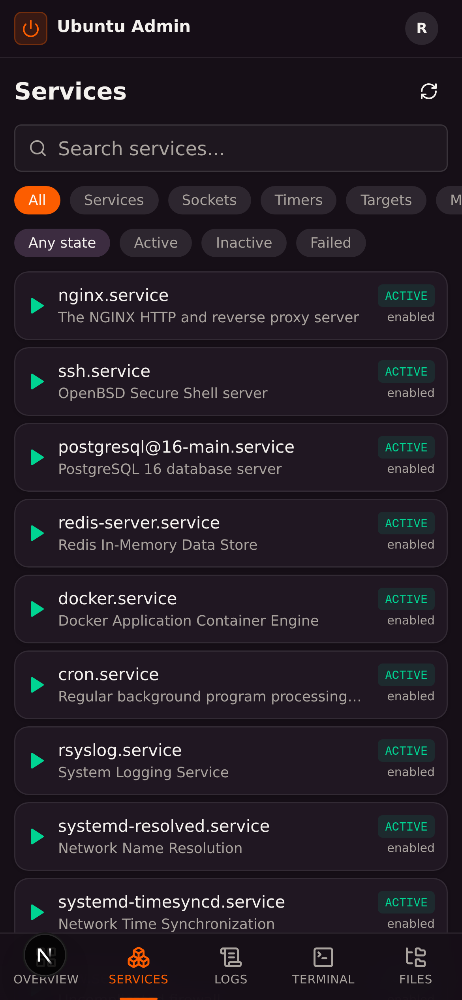
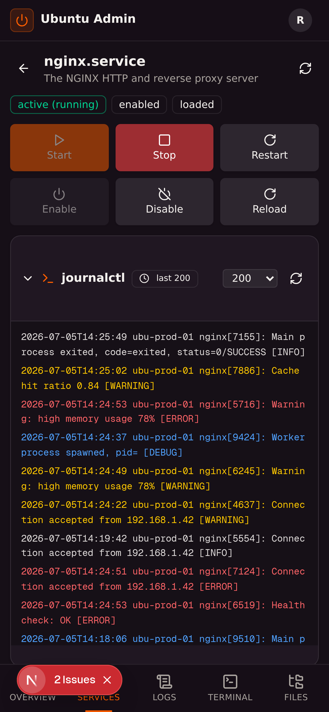
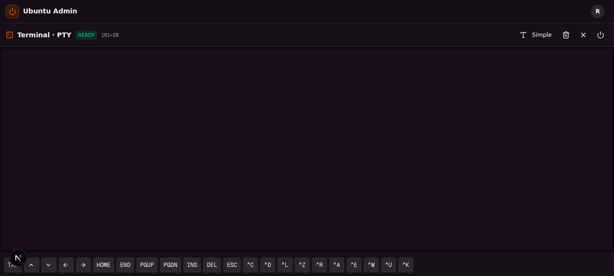
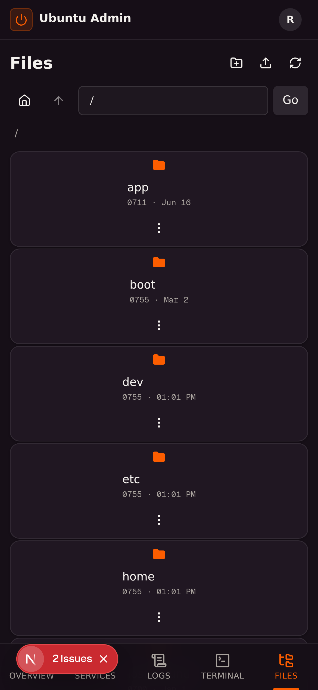
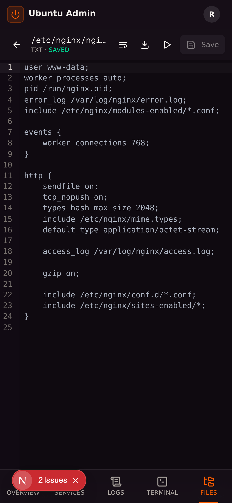
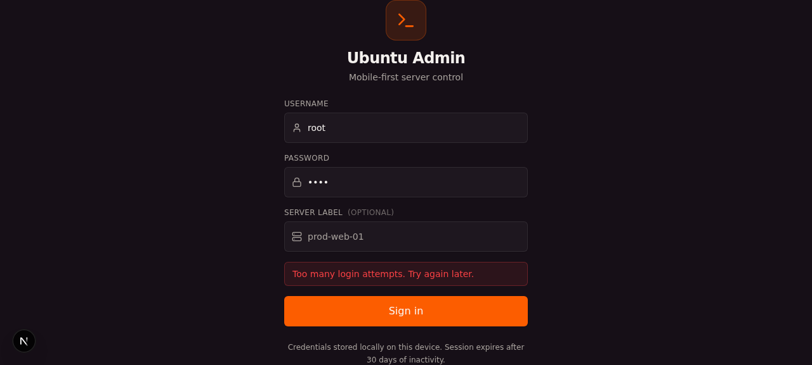

<div align="center">



# 🟠 Ubuntu Admin

### Mobile-first server control panel for Ubuntu

[](https://nextjs.org/)
[](https://www.typescriptlang.org/)
[](https://tailwindcss.com/)
[](https://ui.shadcn.com/)
[](https://github.com/microsoft/node-pty)
[](LICENSE)

<p>
  <strong>systemd management</strong> · <strong>real PTY terminal</strong> · <strong>file editor</strong> · <strong>journalctl viewer</strong>
</p>

<p>
  <em>Browser-based admin panel designed for phones first. Authenticate once, manage your box from anywhere — even on a tiny screen.</em>
</p>

---

</div>

## ✨ Features

<table>
<tr>
<td width="50%" valign="top">

### 🟢 systemd Control
- List / filter / search all units (services, sockets, timers, targets, mounts)
- **One-tap actions**: start, stop, restart, reload, enable, disable
- Per-service detail page with `systemctl status` output
- Inline `journalctl -u <name>` viewer with selectable line count
- Direct deep-links: open `#/service/nginx.service` in a new tab

</td>
<td width="50%" valign="top">

### 📡 Real PTY Terminal
- Full bash session via `node-pty` — not a fake shell
- Run **TUI apps**: `htop`, `vim`, `nano`, `top`, `mc`, `btop`
- `xterm.js` renderer with proper ANSI 256-color support
- Auto-resize via `ResizeObserver`
- Mobile special-keys bar: Tab, arrows, Home/End, ^C/^L/^U/^W/^A/^E/^R/^K/^Z
- **Falls back to simple text-mode** for quick one-shot commands

</td>
</tr>
<tr>
<td width="50%" valign="top">

### 📁 File Manager
- Real filesystem browsing with address bar
- Breadcrumb navigation, home/up buttons
- Upload (multipart), download, mkdir, delete, rename
- File-type icons (code, text, folder)
- **Open any file in the editor** at `#/files/edit?path=...`

</td>
<td width="50%" valign="top">

### ✏️ Code Editor
- CodeMirror 6 with syntax highlighting
- Languages: **js, ts, py, go, toml, html, css, json, rust, md**
- Auto-format via `prettier` / `black` / `gofmt` / `taplo` (with builtin fallback)
- Word-wrap toggle, line numbers, bracket matching, autocompletion
- `Ctrl+S` to save, dirty-state indicator

</td>
</tr>
<tr>
<td width="50%" valign="top">

### 📜 Log Viewer
- General `journalctl` with filters (since, priority, unit, line count)
- Auto-refresh every 10s (pausable)
- Auto-scroll toggle, **colorized output** (ERROR / WARN / DEBUG)
- Download logs as `.log` file
- Mock fallback in preview sandbox

</td>
<td width="50%" valign="top">

### 🚀 Performance & UX
- **SWR caching** — instant response from localStorage, refresh in background
- **Rolling 30-day session** — credentials stored locally, refreshed on each call
- Mobile-first bottom nav (44px+ touch targets, iOS safe areas)
- Dark Ubuntu theme (aubergine + orange #E95420)
- PWA-ready (installable, standalone display mode)
- All routes hash-addressable — deep links work in new tabs

</td>
</tr>
<tr>
<td width="50%" valign="top">

### 🛡️ Audit Log & Security
- **App-level audit log** — every UI action (service control, file edit, login) recorded
- Filter by action type, search across entries, paginated (50/page)
- Disable via `AUDIT_LOG_ENABLED=false` env var
- **Rate limiting** on `/api/auth/login` (5 attempts / 15 min, configurable)
- **Device session list** — see all active sessions, revoke any you don't recognize
- Web Push notifications when services fail (subscribe via profile menu)

</td>
<td width="50%" valign="top">

### ⭐ Bookmarks
- **Pin services and files** — star icon on every service row
- Pinned items shown at the top of services list (chips)
- Dedicated `/bookmarks` page for management
- Stored per-device in localStorage (no server sync — fast)

</td>
</tr>
</table>

---

## 📸 Screenshots

<div align="center">

### 🏠 Overview Dashboard


*System info, services summary, failed services alert*

---

### 📦 Services List with Bookmarks


*27 units with type/status filters, search, and bookmark chips*

---

### ⚙️ Service Detail


*Status badges, action buttons, inline journalctl*

---

### 🖥️ PTY Terminal (TUI-ready)


*Real bash with xterm.js — runs htop, vim, nano*

---

### 📂 File Manager


*Address bar, breadcrumbs, upload/download*

---

### ✏️ File Editor


*CodeMirror with syntax highlighting and auto-format*

---

### 📜 Audit Log


*Every UI action tracked — who, what, when, from where*

---

### 🛡️ Device Sessions


*See active sessions, revoke compromised devices*

</div>

---

## 🏗️ Architecture

```
┌────────────────────────────────────────────────────────────────┐
│                     Browser (Mobile / Desktop)                  │
│  ┌──────────────┐  ┌──────────────┐  ┌──────────────┐         │
│  │  Overview    │  │  Services    │  │  Logs        │         │
│  │  Dashboard   │  │  + Detail    │  │  Viewer      │         │
│  └──────────────┘  └──────────────┘  └──────────────┘         │
│  ┌──────────────┐  ┌──────────────┐  ┌──────────────┐         │
│  │  PTY Terminal│  │  File Mgr    │  │  File Editor │         │
│  │  (xterm.js)  │  │  (address bar)│  │ (CodeMirror) │         │
│  └──────────────┘  └──────────────┘  └──────────────┘         │
│         │                  │                  │                 │
│         ▼                  ▼                  ▼                 │
│  ┌──────────────────────────────────────────────────────┐     │
│  │  SWR Cache (localStorage) + 30-day rolling session   │     │
│  └──────────────────────────────────────────────────────┘     │
└────────────────────────────────┬───────────────────────────────┘
                                 │ Basic Auth
                                 ▼
┌────────────────────────────────────────────────────────────────┐
│                    Next.js 16 App Router                         │
│  ┌──────────────────────────────────────────────────────┐      │
│  │  API Routes (port 3000)                              │      │
│  │  • /api/auth/login     • /api/services/[name]        │      │
│  │  • /api/services       • /api/services/[name]/logs   │      │
│  │  • /api/logs           • /api/terminal/exec          │      │
│  │  • /api/files          • /api/terminal/complete      │      │
│  │  • /api/files/save     • /api/files/upload           │      │
│  │  • /api/files/download • /api/files/format           │      │
│  │  • /api/pty/connect    • /api/pty/input              │      │
│  │  • /api/pty/output     • /api/pty/resize             │      │
│  │  • /api/pty/kill       • /api/system                 │      │
│  └──────────────────────────────────────────────────────┘      │
│         │                  │                  │                 │
│         ▼                  ▼                  ▼                 │
│  ┌──────────────┐  ┌──────────────┐  ┌──────────────┐         │
│  │  systemd /   │  │  bash -c     │  │  node-pty    │         │
│  │  journalctl  │  │  (stateless) │  │  (PTY pool)  │         │
│  └──────────────┘  └──────────────┘  └──────────────┘         │
└────────────────────────────────────────────────────────────────┘
```

---

## 🚀 Quick Start

### Prerequisites
- Ubuntu 20.04+ (or any systemd-based Linux)
- Node.js 18+ and Bun (or npm/yarn/pnpm)
- Root or sudoer account (for `systemctl` to actually control services)

### Install

```bash
git clone https://github.com/megamen32/ubuntu-admin.git
cd ubuntu-admin
bun install        # or: npm install
```

### Develop

```bash
bun run dev        # starts Next.js on :3000
```

Open http://localhost:3000, enter any username/password (preview mode accepts any non-empty pair).

### Production

```bash
bun run build
bun run start
```

For real auth, deploy behind a reverse proxy with PAM/sudo validation, then remove the fallback in `src/app/api/auth/login/route.ts`.

---

## 📱 Mobile Usage

The whole UI is **mobile-first**:
- Install as PWA (Add to Home Screen) for full-screen standalone experience
- Bottom navigation with 5 tabs (Overview / Services / Logs / Terminal / Files)
- 44px+ touch targets, iOS safe-area insets
- Special-keys bar in terminal for keys missing on mobile keyboards
- Compact mode: PTY terminal uses full viewport with hidden bottom nav

---

## 🔐 Authentication

- Credentials stored in `localStorage` (intentional — enables rolling sessions)
- Each API call sends `Authorization: Basic <base64(user:pass)>` header
- `lastActivity` timestamp refreshed on every call → **rolling 30-day expiry**
- Active sessions never expire; only idle ones do
- Click your avatar (top-right) to see remaining session time and sign out

**Production warning**: storing passwords in localStorage is intentional for this admin tool, but means anyone with browser access can extract them. For multi-user production deployments, switch to NextAuth.js with proper session tokens.

---

## 🛠️ Tech Stack

| Layer | Technology |
|-------|-----------|
| Framework | Next.js 16 (App Router, Turbopack) |
| Language | TypeScript 5 (strict) |
| Styling | Tailwind CSS 4 + shadcn/ui (New York) |
| State | React hooks + localStorage (no Redux/Zustand needed) |
| Caching | SWR pattern in `lib/api-client.ts` |
| Terminal | xterm.js 6 + node-pty 1.1 |
| Editor | CodeMirror 6 + language extensions |
| Auth | Basic auth + rolling 30-day localStorage session |
| Icons | lucide-react |
| Notifications | sonner |
| Charts | recharts (available, not yet used) |

---

## 📂 Project Structure

```
src/
├── app/
│   ├── api/                      # All API routes
│   │   ├── auth/login/
│   │   ├── services/             # List, [name], [name]/logs
│   │   ├── logs/                 # General journalctl
│   │   ├── terminal/             # exec, complete
│   │   ├── pty/                  # connect, input, output, resize, kill
│   │   ├── files/                # CRUD, download, upload, save, format
│   │   └── system/               # System info
│   ├── layout.tsx                # Dark theme + PWA manifest
│   ├── page.tsx                  # Hash-based router
│   └── globals.css               # Ubuntu theme + scrollbar styles
│
├── components/admin/
│   ├── login-screen.tsx
│   ├── app-shell.tsx             # Bottom nav + sticky header
│   ├── overview-page.tsx
│   ├── services/
│   │   ├── services-list.tsx
│   │   └── service-detail.tsx
│   ├── logs/logs-viewer.tsx
│   ├── terminal/
│   │   ├── terminal-wrapper.tsx  # Mode switcher
│   │   ├── pty-terminal.tsx      # xterm.js + HTTP long-polling
│   │   └── terminal-view.tsx     # Simple text-mode
│   └── files/
│       ├── file-manager.tsx
│       └── file-editor.tsx       # CodeMirror 6
│
├── lib/
│   ├── auth.ts                   # 30-day rolling session
│   ├── use-hash-route.ts         # #/service/nginx.service etc.
│   ├── api-client.ts             # SWR cache + Basic auth
│   ├── api-auth.ts               # Server-side auth check
│   ├── server-exec.ts            # bash exec + systemd detection
│   ├── pty-sessions/             # In-process PTY pool
│   │   └── index.ts
│   └── mock-data.ts              # Preview sandbox fallback
│
└── mini-services/
    └── pty-service/              # Standalone socket.io PTY (reference)
```

---

## 🎯 Design Decisions

### Why HTTP long-polling for PTY instead of WebSocket?
Originally implemented as a socket.io mini-service on port 3003, but Next.js rewrites couldn't reliably proxy WebSockets in some sandboxed environments. Moved PTY server inside the Next.js process using HTTP long-polling on port 3000. This keeps everything on a single externally-visible port and avoids proxy issues. The standalone `pty-service` is kept in `mini-services/` as reference for production deployments that prefer process isolation.

### Why hash-based routing?
The preview environment serves everything from `/`. Hash-based routing (`#/services`, `#/service/nginx.service`) lets users open service pages in new browser tabs without server-side route configuration. Each route is fully addressable and bookmarkable.

### Why localStorage for credentials?
The user requested rolling 30-day sessions refreshed on each use. Storing credentials locally (instead of a session token) lets the client re-authenticate each API call independently — no server-side session store needed, no token expiry race conditions. Trade-off: anyone with browser access can extract credentials. For multi-user production, use NextAuth.js with httpOnly cookies.

### Why mock fallback in API routes?
The preview sandbox doesn't have systemd running as PID 1. Each API route checks `hasSystemd()` / `hasJournalctl()` and returns realistic mock data when unavailable. This makes the UI fully demoable without a real Ubuntu host. On a real server, mock is never triggered.

---

## 🔧 Configuration

| Environment | Default | Description |
|------------|---------|-------------|
| `SHELL` | `/bin/bash` | Shell used by PTY sessions |
| `HOME` | `/home/<user>` | Initial cwd for PTY |
| `PORT` | `3000` | Next.js port |

For auto-format support, optionally install:
```bash
sudo apt install prettier  # js/ts/json/html/css
pip install black           # python
sudo apt install golang     # gofmt
cargo install taplo         # toml
```
Built-in formatters are used as fallback when binaries are missing.

---

## 🤝 Contributing

Contributions welcome! Please:

1. Fork the repo
2. Create a feature branch (`git checkout -b feature/amazing-feature`)
3. Commit changes (`git commit -m 'Add amazing feature'`)
4. Push (`git push origin feature/amazing-feature`)
5. Open a Pull Request

### Development setup
```bash
bun install
bun run lint     # ESLint
bun run dev      # http://localhost:3000
```

---

## 📄 License

MIT — see [LICENSE](LICENSE).

---

## 🙏 Acknowledgments

- [Ubuntu](https://ubuntu.com/) — Aubergine + Orange color palette
- [shadcn/ui](https://ui.shadcn.com/) — Component system
- [xterm.js](https://xtermjs.org/) — Terminal renderer
- [CodeMirror](https://codemirror.net/) — Code editor
- [node-pty](https://github.com/microsoft/node-pty) — PTY bindings

---

<div align="center">

**Built with 🟠 by [megamen32](https://github.com/megamen32)**

⭐ Star this repo if it helped you!

</div>
